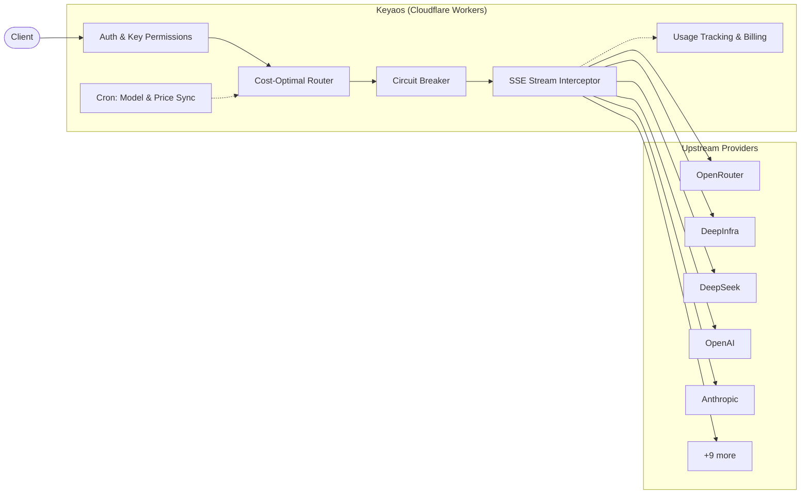

<p align="center">
  
</p>

<h1 align="center">Keyaos</h1>

<p align="center">
  Edge-native AI API gateway — cost-optimized routing across providers, multi-protocol support, built on Cloudflare Workers.
</p>

<p align="center">
  
  
  
</p>

<p align="center">
  <a href="https://deploy.workers.cloudflare.com/?url=https://github.com/BingoWon/Keyaos">
    
  </a>
</p>

<p align="center">
  <a href="README_CN.md">🌏 中文</a> ·
  <a href="https://keyaos.com">🌐 Website</a> ·
  <a href="https://keyaos.com/werewolf">🐺 Werewolf</a> ·
  <a href="https://keyaos.com/docs">📖 Docs</a> ·
  <a href="https://keyaos.com/api-reference">📡 API Reference</a>
</p>

---

You subscribe to multiple AI services — OpenRouter, DeepSeek, Google AI Studio, xAI, and more. Each has its own API key, pricing, and quota. **Keyaos unifies them behind multi-protocol API endpoints** (OpenAI, Anthropic, and more), automatically routing every request to the cheapest healthy provider.

Built entirely on **Cloudflare Workers + D1 + Cron Triggers**. Self-hosted deployments require no servers and fit within Cloudflare's free tier.

## 🏗 Architecture



**Request flow:** Client sends a request to any supported endpoint. Auth validates the API key and checks permissions (model restrictions, quota, expiry, IP). The router ranks all available credentials by `unit_price × multiplier` and picks the cheapest healthy one. The circuit breaker skips providers with recent failures. The SSE interceptor tee's the response stream — forwarding it to the client in real time while extracting usage data for billing in the background. A Cron job syncs model availability and pricing every minute.

## ✨ Features

- **Cost-optimized routing** — every request goes to the cheapest available provider
- **Automatic failover** — quota exceeded or rate limited? The next cheapest option takes over
- **Zero-latency streaming** — SSE responses are tee'd and forwarded in real time
- **Auto-synced catalog** — model availability and pricing stay up to date via Cron
- **Multi-protocol** — OpenAI Chat & Embeddings, Anthropic Messages, Google Gemini, AWS Event Stream
- **Multimodal** — image generation, image/audio/video/PDF inputs via chat completions
- **Reasoning effort** — unified `reasoning_effort` normalization across providers
- **Circuit breaker** — automatic failure detection and provider bypass
- **API key permissions** — model restrictions, expiration, spending quota, IP allowlist
- **Two modes** — self-hosted (single user) or platform (multi-user with Clerk + Stripe)

## 🚀 Quick Start

### ☁️ One-Click Deploy

Click the **Deploy to Cloudflare** button above, then set one secret:

```bash
npx wrangler secret put ADMIN_TOKEN
```

Done — D1 database, Cron Triggers, and schema are all provisioned automatically.

### 🔧 Manual Setup

```bash
pnpm install
npx wrangler login
npx wrangler d1 create keyaos-db    # update database_id in wrangler.toml
npx wrangler secret put ADMIN_TOKEN
pnpm deploy                          # builds, applies migrations, deploys
```

### 💻 Local Development

```bash
cp .env.example .env.local           # fill in provider keys
cp .dev.vars.example .dev.vars       # fill in secrets (ADMIN_TOKEN, etc.)
pnpm db:setup:local
pnpm dev                             # http://localhost:5173
```

## 📡 Usage

### OpenAI Chat Completions

```bash
curl https://keyaos.<you>.workers.dev/v1/chat/completions \
  -H "Authorization: Bearer YOUR_TOKEN" \
  -H "Content-Type: application/json" \
  -d '{
    "model": "openai/gpt-4o-mini",
    "messages": [{"role": "user", "content": "Hello"}]
  }'
```

### Anthropic Messages

```bash
curl https://keyaos.<you>.workers.dev/v1/messages \
  -H "x-api-key: YOUR_TOKEN" \
  -H "Content-Type: application/json" \
  -d '{
    "model": "anthropic/claude-sonnet-4",
    "max_tokens": 1024,
    "messages": [{"role": "user", "content": "Hello"}]
  }'
```

### Embeddings

```bash
curl https://keyaos.<you>.workers.dev/v1/embeddings \
  -H "Authorization: Bearer YOUR_TOKEN" \
  -H "Content-Type: application/json" \
  -d '{
    "model": "openai/text-embedding-3-small",
    "input": "Hello world"
  }'
```

Works with Cursor, Continue, Cline, aider, LiteLLM, and any tool that supports custom OpenAI or Anthropic base URLs.

## 🔌 Supported Providers

| Provider | Protocol | Pricing Source |
|----------|----------|----------------|
| [OpenRouter](https://openrouter.ai) | OpenAI | `usage.cost` from API |
| [DeepInfra](https://deepinfra.com) | OpenAI | `usage.estimated_cost` from API |
| [ZenMux](https://zenmux.com) | OpenAI | Token × synced price |
| [DeepSeek](https://deepseek.com) | OpenAI | Token × synced price |
| [Google AI Studio](https://aistudio.google.com) | OpenAI | Token × synced price |
| [xAI](https://x.ai) | OpenAI | Token × synced price |
| [Moonshot](https://moonshot.cn) | OpenAI | Token × synced price |
| [OpenAI](https://openai.com) | OpenAI | Token × synced price |
| [OAIPro](https://oaipro.com) | OpenAI | Token × synced price |
| [Qwen Code](https://chat.qwen.ai) | OpenAI | Token × synced price |
| Gemini CLI | Google Gemini | Token × synced price |
| Antigravity | Google Gemini | Token × synced price |
| [Kiro](https://kiro.dev) | AWS Event Stream | Token × synced price |
| Anthropic | Anthropic Messages | Token × synced price |

Adding a new OpenAI-compatible provider takes a single entry in the provider registry.

## ⚙️ Core vs Platform

```
Core (self-hosted)           Platform (multi-user)
├── Credential pool          ├── Everything in Core, plus:
├── Cost-optimal routing     ├── Clerk authentication
├── Multi-protocol proxy     ├── Stripe billing & auto top-up
├── Circuit breaker          ├── Shared credential marketplace
├── Auto-sync catalog        ├── Gift cards / redemption codes
├── Embeddings endpoint      └── Admin console & analytics
├── API key permissions
└── ADMIN_TOKEN auth
```

Platform is strictly additive — Core runs independently and never depends on Platform.

## 🖥 Frontend

Keyaos ships with a full frontend built with React 19, Vite 7, and Tailwind CSS 4:

- **Model catalog** — browsable, searchable listing of all available models with live prices
- **Provider directory** — per-provider pages with model counts and credential health
- **OHLC price charts** — financial-grade candlestick charts tracking model price history
- **Chat UI** — built-in chat interface powered by AI SDK
- **API reference** — interactive OpenAPI 3.1 documentation via Scalar
- **MDX docs** — 16 pages of embedded documentation including multimodal guides
- **Dark mode** — full light / dark / system theme support
- **i18n** — English and Chinese

## 🛠 Tech Stack

| Layer | Technology |
|-------|-----------|
| Runtime | Cloudflare Workers |
| Database | Cloudflare D1 (SQLite) |
| Scheduler | Cron Triggers (every minute) |
| Frontend | React 19 · Vite 7 · Tailwind CSS 4 |
| UI | Radix UI · Headless UI · Framer Motion |
| Backend | Hono 4 · TypeScript |
| Auth | Clerk (platform mode) |
| Payments | Stripe (platform mode) |
| Charts | Lightweight Charts (OHLC) |
| Docs | MDX · Scalar (OpenAPI) |

## 🤝 Contributing

Contributions are welcome! Whether it's a bug fix, new provider integration, feature request, or documentation improvement — we'd love your help.

1. **Fork** the repository
2. **Create** a feature branch (`git checkout -b feat/amazing-feature`)
3. **Commit** your changes (`git commit -m "feat: add amazing feature"`)
4. **Push** to the branch (`git push origin feat/amazing-feature`)
5. **Open** a Pull Request

If you're unsure where to start, check out the [open issues](https://github.com/BingoWon/Keyaos/issues) or start a [discussion](https://github.com/BingoWon/Keyaos/discussions). All contributions, big or small, are greatly appreciated.
