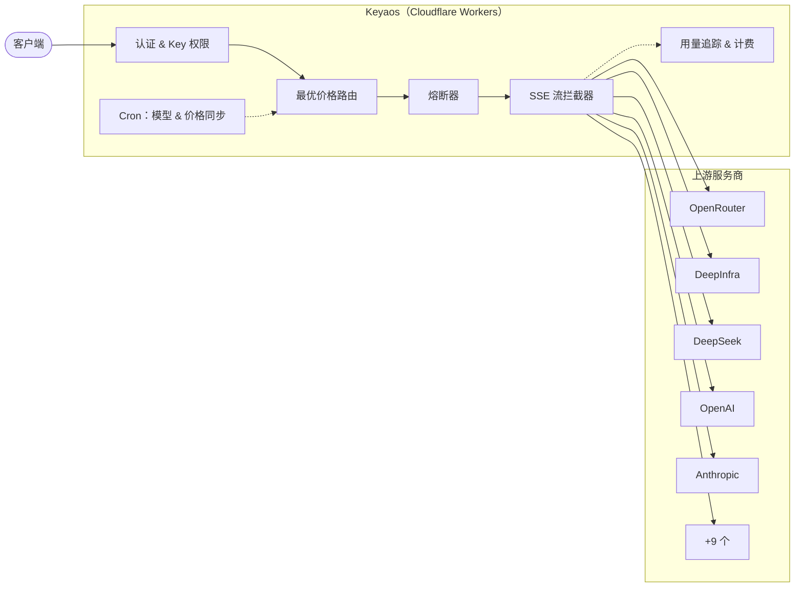

<p align="center">
  
</p>

<h1 align="center">Keyaos（氪钥枢）</h1>

<p align="center">
  边缘原生 AI API 网关 — 跨服务商最优价格路由，多协议支持，构建于 Cloudflare Workers。
</p>

<p align="center">
  
  
  
</p>

<p align="center">
  <a href="https://deploy.workers.cloudflare.com/?url=https://github.com/BingoWon/Keyaos">
    
  </a>
</p>

<p align="center">
  <a href="README.md">🌏 English</a> ·
  <a href="https://keyaos.com">🌐 官网</a> ·
  <a href="https://keyaos.com/werewolf">🐺 狼人杀</a> ·
  <a href="https://keyaos.com/docs">📖 文档</a> ·
  <a href="https://keyaos.com/api-reference">📡 API 参考</a>
</p>

---

你同时在用 OpenRouter、DeepSeek、Google AI Studio、xAI 等多个 AI 服务，每个都有各自的 API Key、计费方式和用量限制。**Keyaos 把它们统一在多协议 API 端点背后**（OpenAI、Anthropic 等），每次请求自动选择当前价格最低的健康服务商。

完全基于 **Cloudflare Workers + D1 + Cron Triggers** 构建。自部署无需服务器，Cloudflare 免费额度即可承载。

## 🏗 架构



**请求流程：** 客户端向任一端点发起请求。Auth 校验 API Key 并检查权限（模型限制、配额、到期时间、IP）。路由器按 `单价 × 倍率` 对所有凭证排序，选出最便宜的健康选项。熔断器跳过近期故障的服务商。SSE 拦截器对响应流做 tee — 实时转发给客户端的同时，在后台提取用量数据用于计费。Cron 任务每分钟同步模型可用性和价格。

## ✨ 功能特性

- **最优价格路由** — 每次请求都走当前最便宜的服务商
- **自动故障转移** — 配额耗尽或被限速？自动切换到下一个最优选项
- **零延迟流式** — SSE 响应实时拆分转发，不做缓冲
- **自动同步目录** — 模型可用性和价格通过 Cron 定时更新
- **多协议支持** — OpenAI Chat & Embeddings、Anthropic Messages、Google Gemini、AWS Event Stream
- **多模态** — 图片生成、图片/音频/视频/PDF 输入，通过 chat completions 透传
- **推理强度** — 跨服务商统一归一化 `reasoning_effort` 参数
- **熔断器** — 自动检测故障并绕过异常服务商
- **API Key 权限** — 模型限制、到期时间、用量配额、IP 白名单
- **双模式** — 自部署（单用户）或平台模式（多用户，集成 Clerk + Stripe）

## 🚀 快速上手

### ☁️ 一键部署

点击上方 **Deploy to Cloudflare** 按钮，然后设置一个密钥：

```bash
npx wrangler secret put ADMIN_TOKEN
```

搞定 — D1 数据库、Cron Triggers 和表结构全部自动创建。

### 🔧 手动部署

```bash
pnpm install
npx wrangler login
npx wrangler d1 create keyaos-db    # 将 database_id 填入 wrangler.toml
npx wrangler secret put ADMIN_TOKEN
pnpm deploy                          # 构建、执行迁移、部署
```

### 💻 本地开发

```bash
cp .env.example .env.local           # 填入服务商密钥
cp .dev.vars.example .dev.vars       # 填入 secrets（ADMIN_TOKEN 等）
pnpm db:setup:local
pnpm dev                             # http://localhost:5173
```

## 📡 使用方式

### OpenAI Chat Completions

```bash
curl https://keyaos.<you>.workers.dev/v1/chat/completions \
  -H "Authorization: Bearer YOUR_TOKEN" \
  -H "Content-Type: application/json" \
  -d '{
    "model": "openai/gpt-4o-mini",
    "messages": [{"role": "user", "content": "Hello"}]
  }'
```

### Anthropic Messages

```bash
curl https://keyaos.<you>.workers.dev/v1/messages \
  -H "x-api-key: YOUR_TOKEN" \
  -H "Content-Type: application/json" \
  -d '{
    "model": "anthropic/claude-sonnet-4",
    "max_tokens": 1024,
    "messages": [{"role": "user", "content": "Hello"}]
  }'
```

### 嵌入

```bash
curl https://keyaos.<you>.workers.dev/v1/embeddings \
  -H "Authorization: Bearer YOUR_TOKEN" \
  -H "Content-Type: application/json" \
  -d '{
    "model": "openai/text-embedding-3-small",
    "input": "Hello world"
  }'
```

兼容 Cursor、Continue、Cline、aider、LiteLLM 及任何支持自定义 OpenAI 或 Anthropic Base URL 的工具。

## 🔌 支持的服务商

| 服务商 | 协议 | 计价方式 |
|--------|------|----------|
| [OpenRouter](https://openrouter.ai) | OpenAI | 上游 API 返回 `usage.cost` |
| [DeepInfra](https://deepinfra.com) | OpenAI | 上游 API 返回 `usage.estimated_cost` |
| [ZenMux](https://zenmux.com) | OpenAI | Token × 同步价格 |
| [DeepSeek](https://deepseek.com) | OpenAI | Token × 同步价格 |
| [Google AI Studio](https://aistudio.google.com) | OpenAI | Token × 同步价格 |
| [xAI](https://x.ai) | OpenAI | Token × 同步价格 |
| [Moonshot](https://moonshot.cn) | OpenAI | Token × 同步价格 |
| [OpenAI](https://openai.com) | OpenAI | Token × 同步价格 |
| [OAIPro](https://oaipro.com) | OpenAI | Token × 同步价格 |
| [Qwen Code](https://chat.qwen.ai) | OpenAI | Token × 同步价格 |
| Gemini CLI | Google Gemini | Token × 同步价格 |
| Antigravity | Google Gemini | Token × 同步价格 |
| [Kiro](https://kiro.dev) | AWS Event Stream | Token × 同步价格 |
| Anthropic | Anthropic Messages | Token × 同步价格 |

新增一个 OpenAI 兼容的服务商只需在 registry 中添加一条配置。

## ⚙️ Core 与 Platform

```
Core（自部署）               Platform（多用户）
├── 凭证池                   ├── Core 全部功能，加上：
├── 最优价格路由             ├── Clerk 身份认证
├── 多协议代理               ├── Stripe 计费 & 自动充值
├── 熔断器                   ├── 共享凭证市场
├── 自动同步目录             ├── 礼品卡 / 兑换码
├── 嵌入端点                 └── 管理后台 & 数据分析
├── API Key 权限
└── ADMIN_TOKEN 认证
```

Platform 是 Core 的纯增量扩展 — Core 独立运行，不依赖 Platform。

## 🖥 前端

Keyaos 内置了完整的前端，基于 React 19、Vite 7 和 Tailwind CSS 4 构建：

- **模型目录** — 可浏览、可搜索的模型列表，实时显示价格
- **服务商目录** — 每个服务商的独立页面，展示模型数量和凭证状态
- **OHLC 价格图表** — 金融级 K 线图，追踪模型价格变动历史
- **聊天界面** — 内置对话 UI，基于 AI SDK
- **API 参考** — 基于 Scalar 的交互式 OpenAPI 3.1 文档
- **MDX 文档** — 16 页内嵌文档，包含多模态使用指南
- **深色模式** — 完整的亮色 / 暗色 / 跟随系统主题
- **多语言** — 英文和中文

## 🛠 技术栈

| 层级 | 技术 |
|------|------|
| 运行时 | Cloudflare Workers |
| 数据库 | Cloudflare D1（SQLite）|
| 定时任务 | Cron Triggers（每分钟）|
| 前端 | React 19 · Vite 7 · Tailwind CSS 4 |
| UI 组件 | Radix UI · Headless UI · Framer Motion |
| 后端 | Hono 4 · TypeScript |
| 认证 | Clerk（平台模式）|
| 支付 | Stripe（平台模式）|
| 图表 | Lightweight Charts（OHLC）|
| 文档 | MDX · Scalar（OpenAPI）|

## 🤝 参与贡献

欢迎参与贡献！无论是修复 Bug、集成新服务商、提出功能建议还是完善文档，我们都非常期待你的参与。

1. **Fork** 本仓库
2. **创建**功能分支（`git checkout -b feat/amazing-feature`）
3. **提交**你的更改（`git commit -m "feat: add amazing feature"`）
4. **推送**到远程分支（`git push origin feat/amazing-feature`）
5. **发起** Pull Request

如果不确定从哪里入手，欢迎查看 [open issues](https://github.com/BingoWon/Keyaos/issues) 或发起 [discussion](https://github.com/BingoWon/Keyaos/discussions)。每一份贡献，无论大小，都值得感谢。
